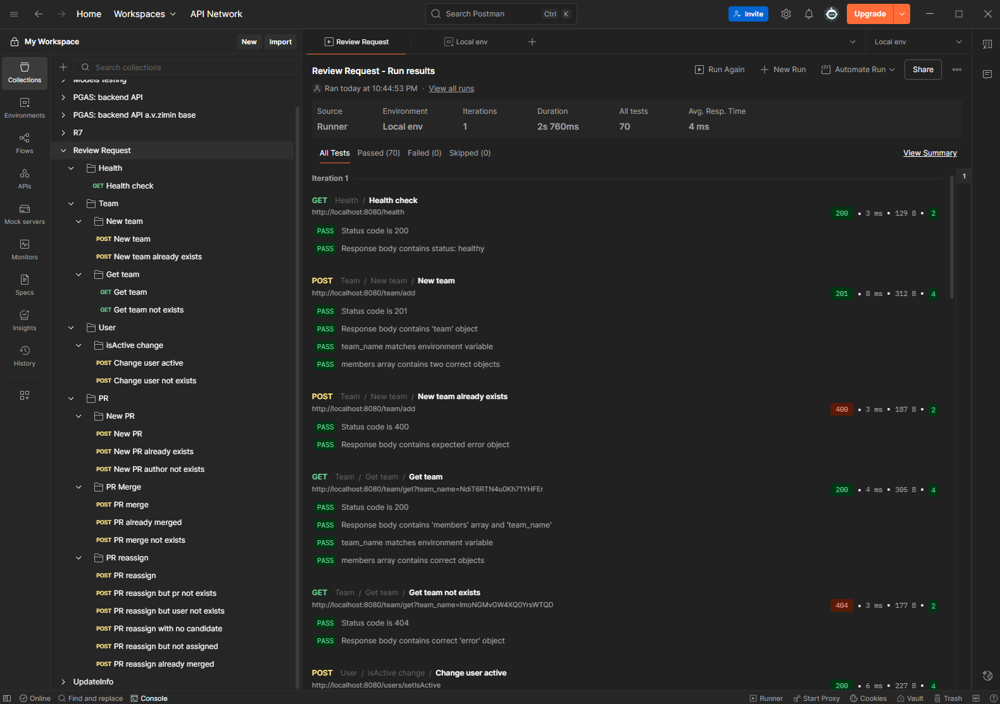
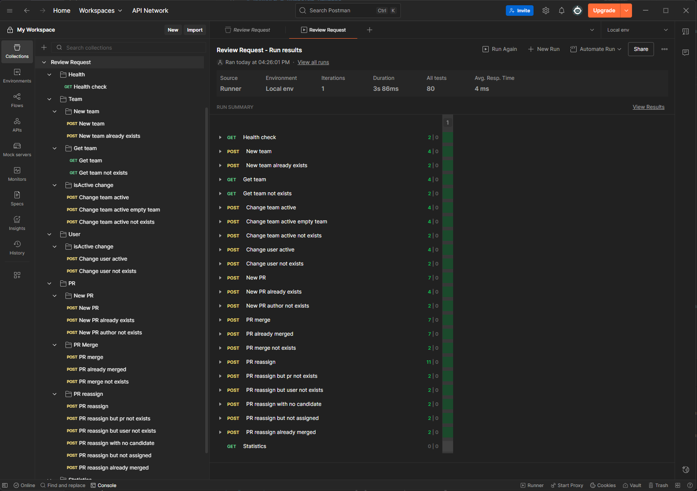

# ReviewRequest

Сервис для автоматического назначения членов команы на код-ревью пул-реквестов

# Установка и запуск

Необходимые компоненты: git, docker

1. Клонировать репозиторий

```
git clone https://github.com/J0hnLenin/ReviewRequest
cd ./ReviewRequest
```

2. При необходимости поменять секреты в файле .env, но этот шаг необязательный
3. Собрать проект

```
docker compose up -d
```

4. После этого можно проверить работу сервиса:
   Port:8080 - backend приложения
   Post:5430 - postgres
   Port:5050 - pgAdmin

При этом порт postgres открыт наружу для тестов и отладки, в продакшн-реализации нужно его закрыть. Если нет необходимости в pgAdmin, его тоже можно убрать.

# Вопросы и принятые решения

## Возможность пользователя состоять в множестве команд одновременно

Можно поступить двумя способами:

1. поддерживать логику 1 пользователь -> множесто команд
2. придерживаться логики 1 пользователь -> 1 команда

Так как операция создания пулл-реквеста требует назначения ревьюеров из команды пользователя, то в случае первого сценария будет неясно из какой именно команды назначать ревьюеров. Поэтому я принял решение пойти по второму сценарию.

Если сервису потребуется расширение и поддержка множества команд для одного пользователя, то можно будет создать новую сущность, которая ставится в соответствие сотруднику и агрегирует несколько экземпляров сущности пользователь.

## Вопрос о хранении данных

Можно поступить следующими способами:

1. хранить данные ненормализовано в jsonb
2. хранить данные частично нормализовано
3. хранить данные полностью нормализовано

В варианте 1 есть преимущество того, что нет необходимости произвоить множество джойнов всех таблиц, из-за чего операции выбора будут достаточно быстрые. Однако индексы в нормализованой БД решают эти проблемы, тем более сложных условий на JOIN мы не накладываем.

Между вариантами 2 и 3 я вижу следующую разницу. Можно вынести отношение PR - reviewers в отдельную таблицу, или хранить в виде массива postgres. Я принял решение хранить в виде массива, потому что нам всегда необходимо получать информацию о ревьюерах, когда мы работаем с пулл-реквестом. А также количество ревьюеров ограничено 2, т.е. размер базы в случае варианта 2 не будет сильно разрастаться, по сравнению с вариантом 3.

## /health

В документации API не указан эндпоинт для проверки сервиса, поэтому я решил добавить эндпоинт  
/health
с ответом формата json:
{  
 "status": "healthy"  
}

## Вопрос об ошибке

В документации API явно не указано, какую ошибку должен возвращать запрос переназначения ревьюера, если ревьюер с данным ID не существует, и при этом PR уже находится в статусе MERGED. Предполагаю, что ошибка должна быть 404 Not found, т.к. сначала необходимо проверить существование сущностей по данным идентификаторам, а затем проверять условия бизнес-логики. Поэтому мой сервис возвращает 404.

# Предложения по улудшению

Если в будущем возникнут проблемы с производительностью данного сервиса (расширится объём базы, увеличиться количество пользователей), то можно будет применить шардирование по командам. Разные команды разбить по разным шардам так, чтобы каждая команда находилась в одном шарде с юзерами и PR, относящейся к ней.

Также хорошо бы хранить информацию об открытых PR и в postgres, и в redis для более быстрого доступа к наиболее важным данным. Считаем что к открытому PR выполняется больше запросов, чем к закрытому.

# Тесты

## E2E-тестирование

Для тестирования использовал postman. Проверил все запросы из спецификации api (/docs/openapi.yml).
Всего вышло 70 тест-кейсов. Коллекция для импорта в postman находится в папке /tests. Проверил как позитивные так и негативные сценарии.




## Unit-тесты

Написал юнит тесты для сервисного слоя. На текущий момент покрытие 89%. Не покрыл случаи,
когда от базы данных возвращается ошибка выполныения запроса, например неверный синтаксис в запросе или потеря соединения. Не знаю необходимо ли это, и, если необходимо, то могу дополнительно покрыть тестами и эти случаи. Однако в коде сервисного слоя эти сценарии обрабатываются отдельно.

Не покрыт юнит-тестами код апи и код, выполняющий запросы в postgres. Однако этот код я протестировал во время E2E-тестов. 
