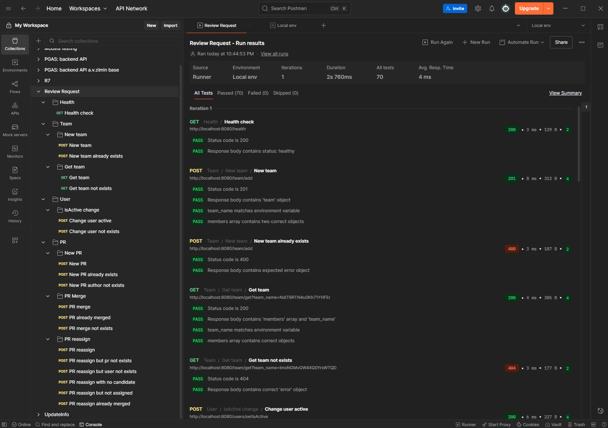
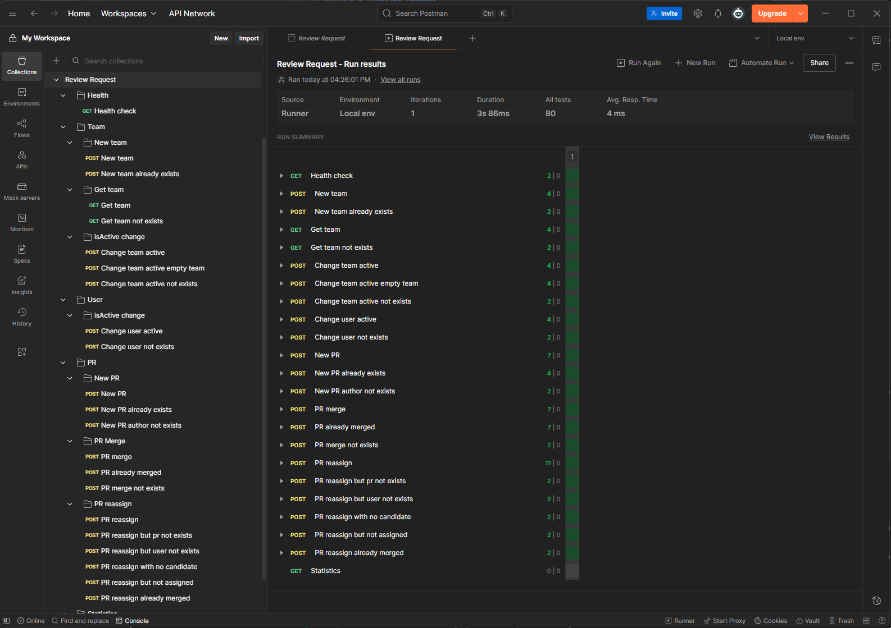

# **ReviewRequest**

[](https://github.com/J0hnLenin/ReviewRequest/actions/workflows/coverage.yml)
[](https://coveralls.io/github/J0hnLenin/ReviewRequest)
[](https://github.com/J0hnLenin/ReviewRequest/actions/workflows/lint.yml)  


Внутри команды требуется единый микросервис, который автоматически назначает ревьюеров на Pull Request’ы (PR), а также позволяет управлять командами и участниками. Взаимодействие происходит исключительно через HTTP API.
# **Структура проекта**

```
ReviewRequest/
├── app/                # Точка входа
├── domain/             # Слой с моделями
├── internal/           # Слой внешних интерфейсов
│   ├── api/handler/    # API
│   └── repository/     # Хранилища данных
├── service/            # Слой с бизнес-логикой
└── tests/              # E2E тесты
```

# **Установка и запуск**

Необходимые компоненты: git, docker

1. Клонировать репозиторий

```
git clone https://github.com/J0hnLenin/ReviewRequest
cd ./ReviewRequest
```

2. При необходимости поменять секреты в файле .env, но этот шаг необязательный
3. Собрать проект

```
docker compose up -d
```

4. После этого можно проверить работу сервиса:  
   :8080 - backend приложения  
   Post:5430 - postgres  
   Port:5050 - pgAdmin


## **Описание задачи**

Необходимо реализовать сервис, который назначает ревьюеров на PR из команды автора, позволяет выполнять переназначение ревьюверов и получать список PR’ов, назначенных конкретному пользователю, а также управлять командами и активностью пользователей. После merge PR изменение состава ревьюверов запрещено.

## **Общие вводные**

**Пользователь (User)** — участник команды с уникальным идентификатором, именем и флагом активности `isActive`.

**Команда (Team)** — группа пользователей с уникальным именем.

**Pull Request (PR)** — сущность с идентификатором, названием, автором, статусом `OPEN|MERGED`и списком назначенных ревьюверов (до 2).

1. При создании PR автоматически назначаются **до двух** активных ревьюверов из **команды автора**, исключая самого автора.
2. Переназначение заменяет одного ревьювера на случайного **активного** участника **из команды заменяемого** ревьювера.
3. После `MERGED` менять список ревьюверов **нельзя**.
4. Если доступных кандидатов меньше двух, назначается доступное количество (0/1).

## **Условия задания**

* Используйте этот API (OpenAPI-спецификация будет предоставлена отдельным файлом — `openapi.yaml`).
* Объём данных умеренный (до 20 команд и до 200 пользователей), RPS — 5, SLI времени ответа — 300 мс, SLI успешности — 99.9%.
* Пользователь с `isActive = false` не должен назначаться на ревью.
* Операция merge должна быть **идемпотентной** — повторный вызов не приводит к ошибке и возвращает актуальное состояние PR.
* Сервис и его зависимости должны подниматься командой **docker-compose up**. Если решение предусматривает миграции, они также должны применяться при выполнении этой команды. Сервис должен быть доступен на порту 8080.
* Учтите, что соблюдение условий по поднятию сервиса ускорит и упростит проверку вашей работы наставниками.

## **Дополнительные задания**

Эти задания не являются обязательными, но выполнение всех или части из них даст вам преимущество перед другими кандидатами.

* Добавить простой эндпоинт статистики (например, количество назначений по пользователям и/или по PR).
* Провести нагрузочное тестирование полученного решения и приложить краткие результаты тестирования к решению.
* Добавить метод массовой деактивации пользователей команды и безопасную переназначаемость открытых PR (стремиться уложиться в 100 мс для средних объёмов данных).
* Реализовать интеграционное или E2E-тестирование.
* Описать конфигурацию линтера.

## **Требования по стеку**

**Язык сервиса:** предпочтительным будет Go, при этом вы можете выбрать любой, удобный вам.

**База данных:** предпочтительной будет PostgreSQL, при этом вы можете выбрать любую, удобную вам (допускается in-memory реализация).

## **Ход решения**

Если у вас возникнут вопросы по заданию, ответы на которые вы не найдёте в описанных «Условиях», вы вольны принимать решения самостоятельно.  
В таком случае приложите к проекту README-файл, в котором будет список вопросов и пояснения о том, какие допущения вы сделали и почему именно выбранным вами способом.

## **Оформление решения**

Необходимо предоставить публичный git-репозиторий на любом публичном хосте (GitHub / GitLab / etc), содержащий в master/main ветке:

1. Код сервиса
2. Makefile c командами сборки проекта / Описанная в README.md инструкция по запуску
3. Описанные в README.md вопросы/проблемы, с которыми столкнулись, и ваша логика их решений (если требуется)

При этом порт postgres открыт наружу для тестов и отладки, в продакшн-реализации нужно его закрыть. Если нет необходимости в pgAdmin, его тоже можно убрать.

# **Вопросы и принятые решения**

## **Возможность пользователя состоять в множестве команд одновременно**

Можно поступить двумя способами:

1. поддерживать логику 1 пользователь -> множество команд
2. придерживаться логики 1 пользователь -> 1 команда

Так как операция создания пулл-реквеста требует назначения ревьюеров из команды пользователя, то в случае первого сценария будет неясно из какой именно команды назначать ревьюеров. Поэтому я принял решение пойти по второму сценарию.

Если сервису потребуется расширение и поддержка множества команд для одного пользователя, то можно будет создать новую сущность, которая ставится в соответствие сотруднику и агрегирует несколько экземпляров сущности пользователь.

## **Вопрос о хранении данных**

Можно поступить следующими способами:

1. хранить данные ненормализовано в jsonb
2. хранить данные частично нормализовано
3. хранить данные полностью нормализовано

В варианте 1 есть преимущество того, что нет необходимости производить множество джойнов всех таблиц, из-за чего операции выбора будут достаточно быстрые. Однако индексы в нормализованой БД решают эти проблемы, тем более сложных условий на JOIN мы не накладываем.

Между вариантами 2 и 3 я вижу следующую разницу. Можно вынести отношение PR - reviewers в отдельную таблицу, или хранить в виде массива postgres. Я принял решение хранить в виде массива, потому что нам всегда необходимо получать информацию о ревьюерах, когда мы работаем с пулл-реквестом. А также количество ревьюеров ограничено 2, т.е. размер базы в случае варианта 2 не будет сильно разрастаться, по сравнению с вариантом 3.

## **/health**

В документации API не указан эндпоинт для проверки сервиса, поэтому я решил добавить эндпоинт  
/health
с ответом формата json:
{  
 "status": "healthy"  
}

## **Вопрос об ошибке**

В документации API явно не указано, какую ошибку должен возвращать запрос переназначения ревьюера, если ревьюер с данным ID не существует, и при этом PR уже находится в статусе MERGED. Предполагаю, что ошибка должна быть 404 Not found, т.к. сначала необходимо проверить существование сущностей по данным идентификаторам, а затем проверять условия бизнес-логики. Поэтому мой сервис возвращает 404.

# **Предложения по улучшению**

Если в будущем возникнут проблемы с производительностью данного сервиса (расширится объём базы, увеличиться количество пользователей), то можно будет применить шардирование по командам. Разные команды разбить по разным шардам так, чтобы каждая команда находилась в одном шарде с юзерами и PR, относящейся к ней.

Также хорошо бы хранить информацию об открытых PR и в postgres, и в redis для более быстрого доступа к наиболее важным данным. Считаем что к открытому PR выполняется больше запросов, чем к закрытому.

Ещё было бы хорошо в url запросов передавать номер версии API для обратной совместимости, если мы в будущем захотим поменять формат API. Обычно делают так: servise-user:port/api/v1/...
Я добавлять это не стал, т.к. вдруг у вас есть автоматическая проверяющая система, которая не сможет слать запросы в оговоренном формате.

# **API**

## **Краткая таблица эндпоинтов**

| Method | URL                           | Description                                  |
| ------ | ----------------------------- | -------------------------------------------- |
| GET    | /health                       | Проверка работоспособности сервиса           |
| POST   | /team/add                     | Создание новой команды с участниками         |
| GET    | /team/get?team_name={name}    | Получение информации о команде по имени      |
| POST   | /team/setIsActive             | Изменение активности всех участников команды |
| POST   | /users/setIsActive            | Изменение активности пользователя            |
| GET    | /users/getReview?user_id={id} | Получение списка PR пользователя             |
| POST   | /pullRequest/create           | Создание нового пул-реквеста                 |
| POST   | /pullRequest/merge            | Слияние пул-реквеста                         |
| POST   | /pullRequest/reassign         | Переназначение ревьюера в пул-реквесте       |
| GET    | /statistics                   | Получение статистики по PR                   |

Файл спецификации с запросами из задания находится тут: /docs/openapi.yml.

## **Дополнительный эндпоинт статистики**

GET /statistics

Пример ответа json в пустой базе:

```
{
    "total_open_prs": 0,
    "total_closed_prs": 0
}
```

Пример ответа json в базе с данными:

```
{
  "total_open_prs": 15,
  "total_closed_prs": 42,
  "top_open_reviewer": {
    "user_id": "user123",
    "user_name": "John Doe",
    "count": 8
  },
  "top_closed_reviewer": {
    "user_id": "user456",
    "user_name": "Jane Smith",
    "count": 15
  },
  "top_author": {
    "user_id": "user789",
    "user_name": "Bob Wilson",
    "count": 12
  }
}
```

Где:

total_open_prs - Количество открытых PR  
total_closed_prs - Количество смёрженых PR
top_open_reviewer - Ревьюер с максимальным числом открытых PR  
top_closed_reviewer - Ревьюер с максимальным числом закрытых PR  
top_author - Автор максимального числа PR

## **Дополнительный эндпоинт массового изменения активности**

Запрос устанавливает заданный флаг активности у всех участников заданной команды и возвращает изменённую команду.

POST /team/setIsActive

Параметры team_name и is_active указываются в теле запроса.
Пример запроса:

```
{
  "team_name": "testers",
  "is_active": false
}
```

Пример ответа:

```
{
    "members": [
        {
            "is_active": false,
            "user_id": "u1",
            "username": "Maria"
        },
        {
            "is_active": false,
            "user_id": "u2",
            "username": "Nikita"
        }
    ],
    "team_name": "testers"
}
```

Ответ, если команда с таким именем не существует:
```
{
    "error": {
        "code": "NOT_FOUND",
        "message": "resource not found"
    }
}
```
# **Тесты**

## **Unit-тесты**

Написал юнит тесты для сервисного слоя. Не покрыт апи и код, выполняющий запросы в postgres, однако этот код я протестировал во время E2E-тестов.

Запуск тестов:

```
go test -cover ./service
```

## **E2E-тестирование**

Для тестирования использовал postman. Проверил все запросы из спецификации api.
Коллекция для импорта в postman находится в папке /tests. Проверил как позитивные так и негативные сценарии.



